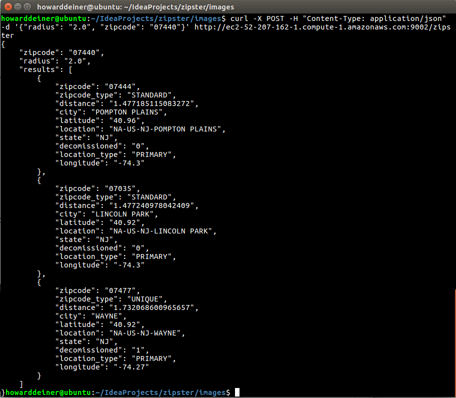

### Building in Docker Containers, testing locally, and buulding AWS Environments on demand (both single instance and clustered).

##### Concept
Why do we use Docker Containers, anyway?  We want to be able to create environments, anything from simple short lived and test isolated environments and right through to production, using the same easy to follow techniques that reduce risk that deployments will go bad.  We reduce this risk by making deployments (even deployment environments) an everyday occurance, and testing frequently.

This project does all of that, and demonstrates a reference solution that includes secrets management using Vault in the process, so we can elimate the tyranny of decentralized environment configuration, and make system secrets something that systems ask for, rather than being pushed onto an environments surface. 

<ul>
<li>Docker containers.  Lots of them.
<li>Java (for our code)
<li>Spark (for running a small REST server)
<li>MySQL (for persistence of a zipcode database)
<li>FlyWay (to version control the database)
<li>Vault is a vital component of this project.  We will use it for holding together environments, the endpoints in those environments,and the secrets needed for those environments.
</ul>

Here's a sample of what zipster does.  It searches for post offices within a given radius of a given zipcode.

---
##### Explanation of the scripts to run.  
The scripts which comprise this project are grouped into three areas.
<ol>
<li>creating the Docker Images we need for our Vault, MySQL, and Spark servers
<li>running the images quickly and locally, such as for when we are developing and testing our code (tests are not included in this project for brevity)
<li>running the images in AWS for two variants.  Both start with Vault being run and available for everyone.
<ul>
<li>bringing up an "AWS-QA" environment.  The name is just to distinguish it from other environments and to hint at the capabilities. 
<li>bringing up and "AWS-QA-ELB" environment.  Again, this name implies how one can put together a clustered environment.  Of course, using terraform, adding or removing additional EC2 instances from this are quite easy. 
</ul>
</ol>
