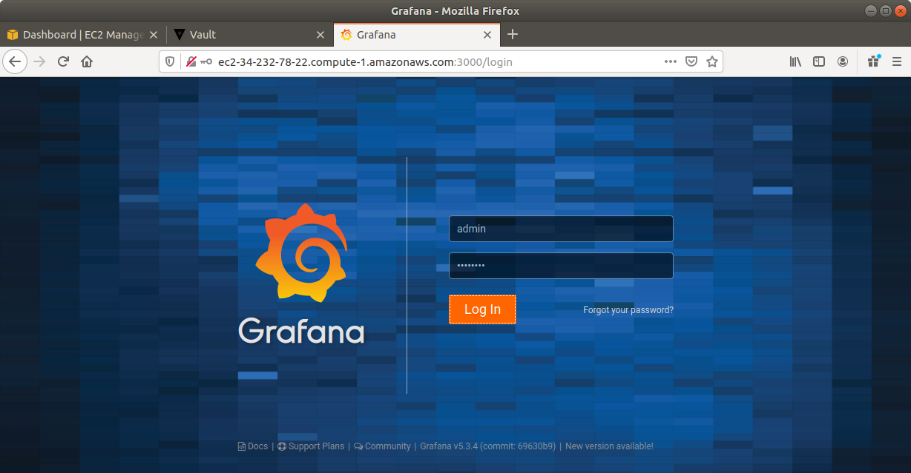
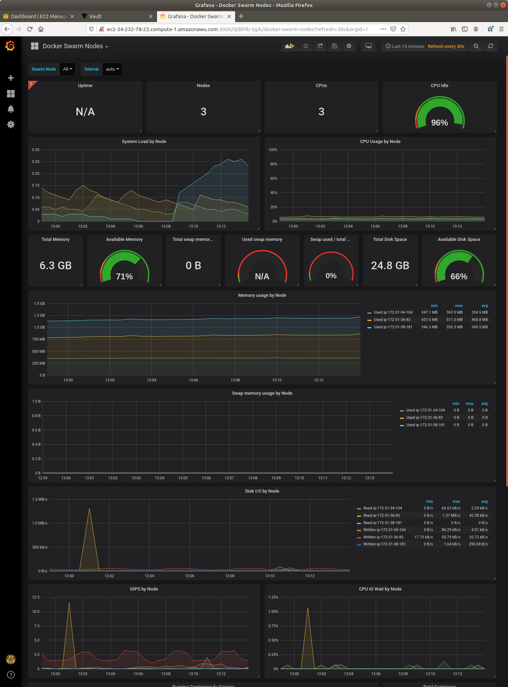
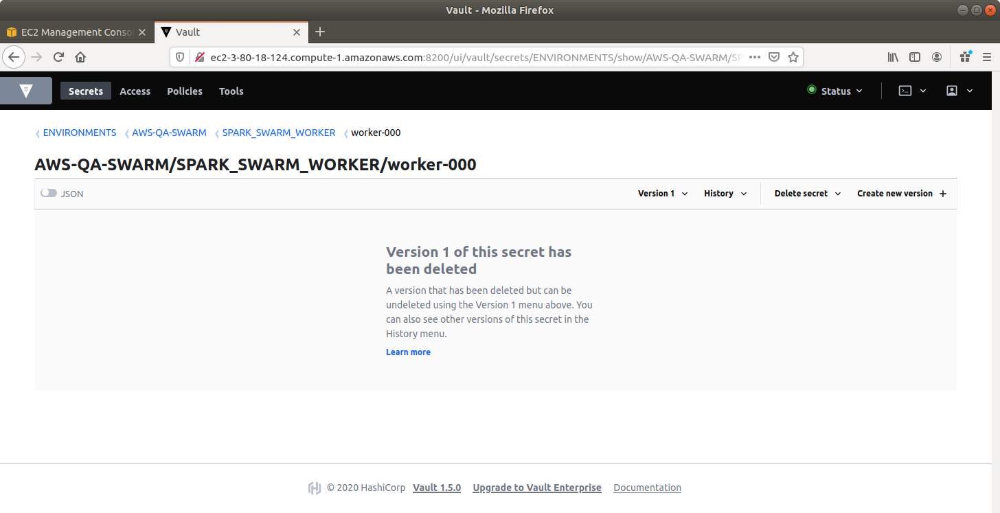

### Building in Docker Containers, testing locally, and building AWS Environments.
<ul>
<li>Single AWS EC2 instances for MySQL and SPARK</li>
<li>AWS EC2 instance for MySQL, multiple AWS EC2 instances for SPARK, AWS ELB for load balancing</li>
<li>AWS EC2 instance for MySQL, AWS EC2 instance for Docker Swarm Manager for load balancing, multiple AWS EC2 instances for Docker Swarm Workers</li>
<li>AWS EC2 instance for MySQL, AWS Lambda for care free load balancing</li>
</ul>

##### Concept
Why do we use Docker Containers, anyway?  We want to be able to create environments, anything from simple short lived and test isolated environments and right through to production, using the same easy to follow techniques that reduce risk that deployments will go bad.  We reduce this risk by making deployments (even deployment environments) an everyday occurance, and testing frequently.

This project does all of that, and demonstrates a reference solution that includes secrets management using Vault in the process, so we can elimate the tyranny of decentralized environment configuration, and make system secrets something that systems ask for, rather than being pushed onto an environments surface. 

<ul>
<li>Docker containers.  Lots of them.  
<li>Docker Swarm orchestration and load balancing for demonstration and non-functional testing against.
<li>Prometheus, Grafana, cAdvisor, Node Exporter, Alert Manager, and Unsee (for environment monitoring and alerting)</li>
<li>Portainer (for container management and trouble shooting)</li>
<li>Java (for our code)
<li>Spark (for running a small REST server)
<li>MySQL (for persistence of a zipcode database)
<li>FlyWay (to version control the database)
<li>Vault is a vital component of this project.  We will use it for holding together environments, the endpoints in those environments,and the secrets needed for those environments.
</ul>

Here's a sample of what zipster does.  It searches for post offices within a given radius of a given zipcode.

---
##### Explanation of the scripts to run.  
The scripts which comprise this project are grouped as follows.
<ol>
<li>creating the Docker Images we need for our Vault, MySQL, and Spark servers
<li>running the images quickly and locally, such as for when we are developing and testing our code (tests are not included in this project for brevity)
<li>running the images in AWS for three variants.  Both start with Vault being run and available for everyone.
<ul>
<li>bringing up an "AWS-QA" environment.  The name is just to distinguish it from other environments and to hint at the capabilities. 
<li>bringing up and "AWS-QA-ELB" environment.  Again, this name implies how one can put together a clustered environment.  Of course, using terraform, adding or removing additional EC2 instances from this are quite easy. 
<li>bringing up and "AWS-QA-ELB" environment.  Again, this name implies how one can put together a clustered environment.  Of course, using terraform, adding or removing additional EC2 instances from this are quite easy. 
</ul>
</ol>
Now, let's go into depth for each script.

---
##### createImages  
\
\
 
\
\
 
\
...\
\
---
##### run_Locally 
\
...\
\
 
\
 
\
---
##### runAWS 01_init 
\
...\
\
---
##### runAWS 02_vault 
\
...\
\
 \
\
\
\
\
[we will bring down Vault at the very end, when everyone is done using it]
---
##### runAWS 03_awsqa  - one ec2 instance for MYSQL and one ec2 instance for Spark Zipster
 \
Bring Up\
\
...\
\
 \
Bring Up - Effect in AWS\
\
 \
Bring Up - Effect in Vault\
\
\
\
\
\
 \
Test\
\
 \
Bring Down\
\
Bring Down - Effect in AWS\
\
 \
Bring Down - Effect in Vault\
\
\
\
---
##### runAWS 04_awsqa_elb  - one ec2 instance for MYSQL, two ec2 instancex for Spark Zipster, one AWS ELB
 \
Bring Up\
\
...\
\
 \
Bring Up - Effect in AWS\
\
\
 \
Bring Up - Effect in Vault\
\
\
\
\
\
\
 \
Test\
\
 \
Bring Down\
\
...\
\
Bring Down - Effect in AWS\
\
 \
Bring Down - Effect in Vault\
\
\
\
\
---
##### runAWS 05_awsqa_swarm  - one ec2 instance for MYSQL, two ec2 instances for Swarm Workers, one ec2 instance for Swarm Manager (plus portainern and prometheus and grafana)
 \
Bring Up\
\
...\
\
 \
Bring Up - Effect in AWS\
\
 \
Bring Up - Effect in Vault\
\
\
\
\
\
\
\
\
\
\
 \
Test\
\
 \
Test - Look at Manager Node\
\
 \
Test - Look at Portainer\
\
\
\
\
\
\
\
 \
Test - Look at Grafana\
\
\
\
\
 \
Bring Down\
\
...\
\
Bring Down - Effect in AWS\
\
 \
Bring Down - Effect in Vault\
\
\
\
\
\
\
\
\
##### runAWS 02_vault [bring down]
\
 \

